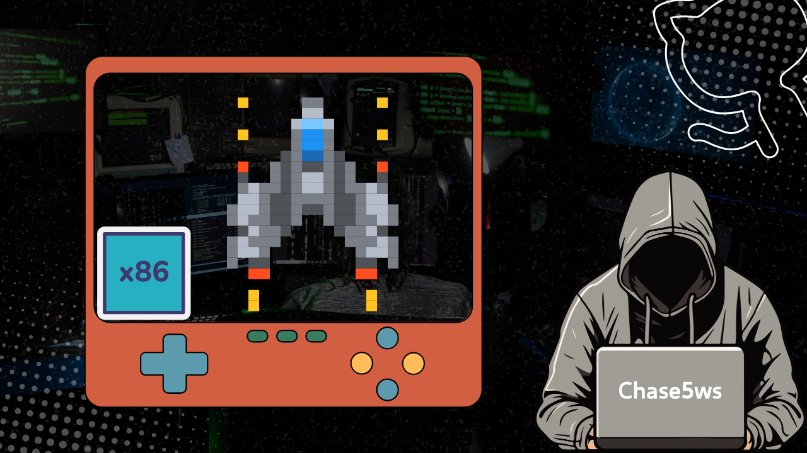

# 打飛機最終釋出版 DEMO (Finally Demo)




---

### 專案說明

這是一個基於 **x86 組合語言** 撰寫的「打飛機遊戲」專案，展示如何使用低階語言實現基本的遊戲邏輯與互動。此專案適用於學習 x86 組合語言的入門者，並提供相關資源幫助快速上手。

---

### DEMO 影片

<iframe width="560" height="315" src="https://www.youtube.com/embed/qM8mDWAQ5ZM" frameborder="0" allow="accelerometer; autoplay; clipboard-write; encrypted-media; gyroscope; picture-in-picture" allowfullscreen></iframe>


---

### 環境安裝 (Environment Settings)

1. 將 `Irvine32.lib` 加入專案設定：
   ```bash
   >> $(ProjectName).lst
   >> Irvine32.lib
   ```

2. 安裝環境指南：
   - [2019 安裝手冊](https://www.dcard.tw/f/fju/p/234561890/)
   - [2017 安裝手冊](https://www.pianshen.com/article/4631256212/)

3. Visual Studio 下載：
   - [Visual Studio 官方網站](https://visualstudio.microsoft.com/zh-hant/downloads/)

4. Irvine32-x86 支援：
   - [Irvine32 安裝指南](http://asmirvine.com/gettingStartedVS2017/index.htm)

---

### 快速參考資源

- **指令快查**：  
  [x86 指令集列表](https://en.wikipedia.org/wiki/X86_instruction_listings?fbclid=IwAR1lZhHLnGZ8oGZMoTXOs-eF0DdOkJaVIpQS6HX6RbdEiADYPk6g9zkR0DM)

- **判斷上下左右或 Enter 的實作**：  
  [StackOverflow 解答](https://stackoverflow.com/questions/46754566/how-do-i-check-if-the-arrow-keys-are-pressed-in-assembly-16-bits-bare-bones)

---

### 美術資源

- **ASCII 圖參考網站**：  
  [ASCII Art 資源](https://www.asciiart.eu/)

- **圖片轉換點陣圖工具**：  
  [ASCII Art 生成器](https://www.twitchquotes.com/ascii-art-generator)

---

### 適用場景

本專案適用於學習 x86 組合語言的學生或開發者，通過實作簡單的遊戲來熟悉程式邏輯、鍵盤輸入處理及圖形化輸出。提供的資源與安裝指南可以快速幫助使用者搭建開發環境，並進一步進行功能擴展。
